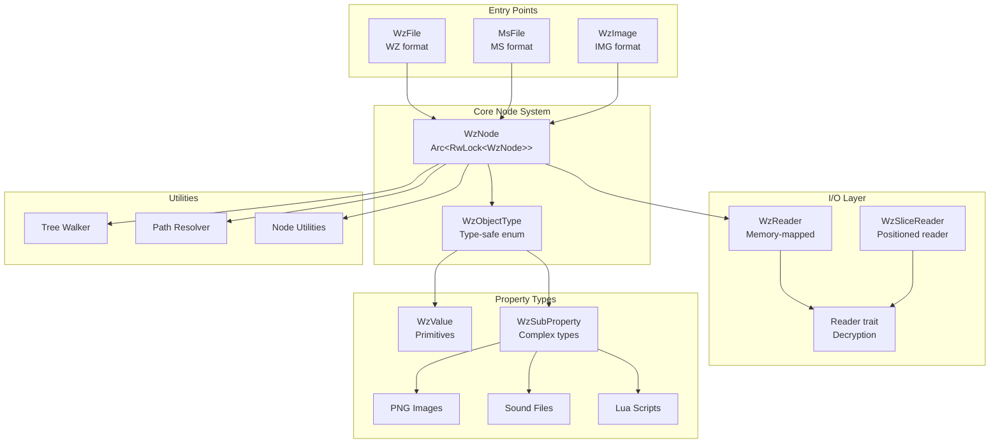

# 系統架構

> **最後更新**: January 18, 2026
> **版本**: 0.0.16

## 概述

**wz-reader-rs** 實作了一個執行緒安全、記憶體高效的架構，用於解析 MapleStory 遊戲資料檔案。此設計強調延遲評估（lazy evaluation）、並行存取和記憶體映射 I/O，以高效處理大型遊戲封存檔。

## 目錄

- [高階架構](#高階架構)
- [核心設計原則](#核心設計原則)
- [元件架構](#元件架構)
- [資料流程](#資料流程)
- [執行緒模型](#執行緒模型)
- [記憶體管理](#記憶體管理)
- [設計模式](#設計模式)
- [型別系統](#型別系統)

---

## 高階架構



---

## 核心設計原則

### 1. **執行緒安全優先**

所有核心型別都設計為支援並行存取：

```rust
// 具有內部可變性的核心節點型別
pub type WzNodeArc = Arc<RwLock<WzNode>>;

pub struct WzNode {
    pub name: WzNodeName,
    pub object_type: WzObjectType,
    pub parent: Weak<RwLock<WzNode>>,  // Weak 參考以避免循環
    pub children: HashMap<WzNodeName, Arc<RwLock<WzNode>>>,
}
```

**關鍵面向：**
- `Arc<RwLock<>>` 允許多個讀取者或單一寫入者
- `Weak` 父參考防止記憶體洩漏
- 透過 `Arc<RwLock<WzMutableKey>>` 共享加密金鑰

### 2. **延遲評估**

節點僅在被存取時才會解析：

```rust
pub fn parse(&mut self, parent: &WzNodeArc) -> Result<(), Error> {
    match self.object_type {
        WzObjectType::Directory(ref mut directory) => {
            if directory.is_parsed {
                return Ok(());  // 如果已解析則跳過
            }
            let childs = directory.resolve_children(parent)?;
            directory.is_parsed = true;
            // ...
        }
        // File、Image 等類似處理
    }
}
```

**優點：**
- 減少大型封存檔的記憶體佔用
- 更快的初始載入時間
- 按需付費的效能模型

### 3. **記憶體映射 I/O**

檔案透過記憶體映射存取：

```rust
pub struct WzBaseReader<T: Sized + AsRef<[u8]>> {
    pub map: T,                    // 記憶體映射資料
    pub wz_iv: [u8; 4],           // 加密 IV
    pub keys: Arc<RwLock<WzMutableKey>>,  // 共享金鑰
}

pub type WzReader = WzBaseReader<Mmap>;  // 使用 memmap2
```

**優勢：**
- 作業系統層級的快取和分頁管理
- 無需將整個檔案載入記憶體
- 對大型封存檔（100+ MB）高效

### 4. **型別安全的物件系統**

所有 WZ 物件都透過型別安全的列舉表示：

```rust
pub enum WzObjectType {
    File(Box<WzFile>),
    MsFile(Box<MsFile>),
    Image(Box<WzImage>),
    MsImage(Box<MsImage>),
    Directory(Box<WzDirectory>),
    Property(WzSubProperty),
    Value(WzValue),
}
```

---

## 元件架構

### 第 1 層：檔案解析器

**目的**：不同檔案格式的進入點

| 元件 | 職責 | 主要方法 |
|-----------|---------------|-------------|
| `WzFile` (src/file.rs:298) | 解析 .wz 封存檔 | `from_file()`, `parse()` |
| `MsFile` (src/ms/file.rs) | 解析 .ms 封存檔（MapleStoryM） | `from_file()`, `parse()` |
| `WzImage` (src/wz_image.rs:207) | 解析 .img 容器 | `from_file()`, `resolve_children()` |

**版本偵測流程：**
```
WzFile::from_file()
  ├─> 猜測 IV（如果未提供）
  │   └─> version::guess_iv_from_wz_file()
  ├─> 使用 IV 建立 WzReader
  └─> 自動偵測修補版本
      ├─> 嘗試版本範圍（1-2000）
      └─> 使用第一個圖像標頭驗證
```

### 第 2 層：節點系統

**目的**：所有遊戲資料的統一樹狀結構

```rust
// src/node.rs:814 行
pub struct WzNode {
    pub name: WzNodeName,
    pub object_type: WzObjectType,
    pub parent: Weak<RwLock<WzNode>>,
    pub children: HashMap<WzNodeName, Arc<RwLock<WzNode>>>,
}
```

**主要功能：**
- 路徑導航：`at()`、`at_path()`、`at_path_parsed()`
- 樹狀遍歷：`filter_parent()`、`get_parent_wz_image()`
- 子節點管理：`add()`、`transfer_childs()`
- 序列化：`to_json()`、`to_simple_json()`

### 第 3 層：I/O 子系統

**目的**：具有加密/解密功能的二進位讀取

```
WzReader（基礎讀取器）
  ├─> 記憶體映射檔案存取
  ├─> 加密金鑰管理
  └─> 建立 WzSliceReader 實例
      └─> WzSliceReader（定位讀取器）
          ├─> 維護讀取位置
          ├─> 實作 Reader trait
          └─> 處理字串解密
```

**Reader trait**（src/reader.rs:1368）：
```rust
pub trait Reader {
    fn get_decrypt_slice(&self, range: Range<usize>) -> Result<Vec<u8>>;
    fn read_u8_at(&self, pos: usize) -> Result<u8>;
    fn read_wz_string(&self) -> Result<String>;
    // ... 超過 20 個型別化讀取方法
}
```

### 第 4 層：屬性系統

**目的**：特定型別的資料容器

```
WzObjectType
├─> WzValue（基本型別）
│   ├─> Int、Short、Long、Float、Double
│   ├─> String（加密）
│   ├─> Vector2D
│   └─> UOL（路徑參考）
│
└─> WzSubProperty（複雜型別）
    ├─> PNG（壓縮圖像）
    ├─> Sound（MP3/二進位音訊）
    ├─> Lua（腳本）
    ├─> Video
    └─> RawData
```

### 第 5 層：工具程式

| 工具程式 | 目的 | 位置 |
|---------|---------|----------|
| `walk_node()` | 遞迴樹狀遍歷 | src/util/walk.rs |
| `resolve_base()` | 多檔案解析 | src/util/resolver.rs |
| `node_util` | 輔助函式 | src/util/node_util.rs |
| `parse_property` | 屬性解析 | src/util/parse_property.rs |

---

## 資料流程

### 解析流程

```
┌─────────────┐
│  使用者程式碼  │
└──────┬──────┘
       │ WzNode::from_wz_file("Base.wz")
       ▼
┌─────────────────┐
│  WzFile 解析器  │
├─────────────────┤
│ 1. 開啟檔案     │
│ 2. 記憶體映射   │
│ 3. 偵測 IV     │
│ 4. 建立金鑰     │
└────────┬────────┘
         │ WzFile::parse()
         ▼
┌─────────────────────┐
│ 版本偵測            │
├─────────────────────┤
│ 1. 讀取標頭         │
│ 2. 猜測修補版本     │
│ 3. 驗證雜湊         │
│ 4. 檢查第一個圖像   │
└──────────┬──────────┘
           │ WzDirectory::resolve_children()
           ▼
┌──────────────────────┐
│  建立子節點          │
├──────────────────────┤
│ 1. 讀取目錄項目      │
│ 2. 建立 WzImage      │
│ 3. 建構節點樹        │
│ 4. 設定父參考        │
└──────────┬───────────┘
           │
           ▼
┌──────────────────────┐
│  WzNode 樹狀結構就緒  │（延遲 - 尚未解析）
└──────────────────────┘
```

### 存取流程（延遲解析）

```
node.at_path_parsed("Character/00002000.img/stand/0")
  │
  ├─> at("Character")
  │     ├─> 找到 WzImage 節點（未解析）
  │     └─> 呼叫 parse()
  │           ├─> 讀取標頭（0x73 或 0x1B）
  │           ├─> 解析屬性列表
  │           └─> 建立子節點
  │
  ├─> at("00002000.img")
  │     └─> 回傳已解析節點
  │
  ├─> at("stand")
  │     └─> 存取子節點（已解析）
  │
  └─> at("0")
        └─> 回傳最終節點
```

### 屬性解析流程

```
parse_property_list()
  │
  ├─> 讀取屬性名稱（WzString）
  │
  ├─> 讀取屬性型別位元組
  │     ├─> 0x00: Null
  │     ├─> 0x0B: Short/Int/Long
  │     ├─> 0x04: Float/Double
  │     ├─> 0x08: String
  │     ├─> 0x09: Property（遞迴）
  │     ├─> Canvas: PNG 圖像
  │     ├─> Sound: 音訊資料
  │     ├─> UOL: 路徑參考
  │     └─> Vector: Vector2D
  │
  └─> 使用適當的 WzObjectType 建立 WzNode
```

---

## 執行緒模型

### 並行設計

**安全的共享存取：**
```rust
// 多個執行緒可以同時讀取
let node = Arc::clone(&root_node);
thread::spawn(move || {
    let read_guard = node.read().unwrap();
    println!("{}", read_guard.name);
});

// 獨佔寫入存取
let mut write_guard = node.write().unwrap();
write_guard.parse(&node)?;
```

**共享加密金鑰：**
```rust
// 金鑰在檔案中的所有讀取器之間共享
pub type SharedWzMutableKey = Arc<RwLock<WzMutableKey>>;

// 使用相同 IV 建立多個檔案時
let base = WzFile::from_file("Base.wz", None, None, None)?;
let ui = WzFile::from_file("UI.wz", None, None, None,
                           Some(&base.reader.keys))?;
```

### 平行處理（選用）

使用 `rayon` 特性：
```rust
#[cfg(feature = "rayon")]
use rayon::prelude::*;

// 平行樹狀遍歷
walk_node_parallel(&root, &|node| {
    // 平行處理節點
});
```

---

## 記憶體管理

### 參考計數策略

```
Arc<RwLock<WzNode>>  ← 強參考（所有權）
    │
    ├─> Children: HashMap<Name, Arc<RwLock<WzNode>>>
    │              └─> 對子節點的強參考
    │
    └─> Parent: Weak<RwLock<WzNode>>
                └─> 弱參考防止循環
```

**為何重要：**
- **無記憶體洩漏**：弱父參考允許樹狀結構被釋放
- **共享所有權**：多個執行緒可以持有 Arc 克隆
- **受控變更**：RwLock 確保安全的並行存取

### 記憶體映射生命週期

```rust
WzFile {
    reader: Arc<WzReader> {
        map: Mmap,  // 作業系統管理的記憶體映射
        keys: Arc<RwLock<WzMutableKey>>,
    }
}
```

**生命週期：**
1. 檔案開啟 → 建立 mmap（未載入資料）
2. 資料存取 → 作業系統按需載入分頁
3. 節點解除解析 → 子節點被釋放，記憶體釋放
4. 檔案釋放 → mmap 自動解除映射

### 解除解析策略

```rust
// 透過清除子節點釋放記憶體
node.write().unwrap().unparse();

// 標記為未解析但保留元資料
pub fn unparse(&mut self) {
    match &mut self.object_type {
        WzObjectType::Image(image) => {
            image.is_parsed = false;
        }
        // ...
    }
    self.children.clear();  // 釋放所有子 Arc
}
```

---

## 設計模式

### 1. 建造者模式

**WzReader 建構：**
```rust
let reader = WzReader::new(mmap)
    .with_iv([0x12, 0x34, 0x56, 0x78])
    .with_existing_keys(shared_keys);
```

### 2. 型別狀態模式

**解析狀態追蹤：**
```rust
pub struct WzImage {
    pub is_parsed: bool,  // 追蹤解析狀態
    // ...
}

// 只能在解析後存取子節點
if !image.is_parsed {
    image.resolve_children()?;
}
```

### 3. 內部可變性

**Arc + RwLock 用於共享可變狀態：**
```rust
pub type WzNodeArc = Arc<RwLock<WzNode>>;

// 透過內部可變性進行變更
node.write().unwrap().parse(&node)?;
```

### 4. 基於 Trait 的多型

**Reader trait 用於多種實作：**
```rust
pub trait Reader {
    fn read_u8_at(&self, pos: usize) -> Result<u8>;
    // ... 通用介面
}

impl Reader for WzSliceReader { /* ... */ }
impl Reader for Snow2Reader { /* ... */ }
impl Reader for ChaCha20Reader { /* ... */ }
```

### 5. 型別安全的轉型

**NodeCast trait 用於安全的向下轉型：**
```rust
pub trait WzNodeCast {
    fn try_as_png(&self) -> Option<&WzPng>;
    fn try_as_image(&self) -> Option<&WzImage>;
    // ... 安全的型別轉換
}
```

### 6. 延遲初始化

**按存取解析模式：**
```rust
pub fn at_path_parsed(&self, path: &str) -> Result<WzNodeArc> {
    pathes.try_fold(first, |node, name| {
        let mut write = node.write().unwrap();
        write.parse(&node)?;  // 僅在存取時解析
        write.at(name).ok_or(Error::NodeNotFound)
    })
}
```

---

## 型別系統

### 物件型別階層

```
WzObjectType（列舉）
├─── 檔案型別（可解析容器）
│    ├─ File(WzFile)          → .wz 封存檔
│    ├─ MsFile(MsFile)        → .ms 封存檔（MapleStoryM）
│    ├─ Image(WzImage)        → .img 容器
│    ├─ MsImage(MsImage)      → .ms 圖像
│    └─ Directory(WzDirectory) → 封存檔中的資料夾
│
├─── Property(WzSubProperty)（具有子節點的複雜型別）
│    ├─ PNG(WzPng)            → 壓縮圖像
│    ├─ Sound(WzSound)        → 音訊檔案
│    ├─ Property              → 通用容器
│    └─ Convex                → 多邊形資料
│
└─── Value(WzValue)（葉節點）
     ├─ Int(i32)
     ├─ Short(i16)、Long(i64)
     ├─ Float(f32)、Double(f64)
     ├─ String(WzString)       → 加密字串
     ├─ Vector(Vector2D)       → 2D 座標
     ├─ UOL(WzString)          → 路徑參考
     ├─ Lua(WzLua)             → 腳本資料
     ├─ Video(WzVideo)         → 影片元資料
     ├─ RawData(WzRawData)     → 二進位資料塊
     └─ Null
```

### 型別轉換

**自動 From 實作：**
```rust
// 基本型別到 WzObjectType
let node = WzNode::new("value", 42, None);  // i32 → WzValue::Int → WzObjectType

// 檔案到 WzObjectType
let wz_file = WzFile::from_file("Base.wz", None, None, None)?;
let obj_type: WzObjectType = wz_file.into();

// 屬性到 WzObjectType
let png = WzPng::default();
let obj_type: WzObjectType = png.into();  // → WzObjectType::Property(WzSubProperty::PNG(...))
```

---

## 錯誤處理

### 錯誤型別

每個模組定義自己的錯誤型別：

```rust
// 節點錯誤（src/node.rs:12）
pub enum Error {
    NodeHasBeenUsing,
    WzDirectoryParseError(directory::Error),
    WzFileParseError(file::Error),
    WzImageParseError(wz_image::Error),
    NodeNotFound,
}

// 檔案錯誤（src/file.rs:14）
pub enum Error {
    FileError(std::io::Error),
    InvalidWzFile,
    ErrorGameVerHash,
    UnknownImageHeader(u8, String),
    // ...
}
```

**錯誤傳播：**
```rust
pub fn parse(&mut self) -> Result<(), Error> {
    let childs = directory.resolve_children(parent)?;
    //                                              ^ ? 運算子轉換錯誤
    Ok(())
}
```

---

## 加密架構

### 金鑰管理

```rust
pub struct WzMutableKey {
    pub iv: [u8; 4],           // 加密 IV
    pub aes_key: [u8; 32],     // AES 金鑰
}

// 在讀取器之間共享
pub type SharedWzMutableKey = Arc<RwLock<WzMutableKey>>;
```

### 解密策略

1. **標準 WZ**：AES + 自訂 XOR（src/util/wz_mutable_key.rs）
2. **MS Snow2**：串流加密（src/ms/snow2_reader.rs）
3. **MS ChaCha20**：ChaCha20 加密（src/ms/chacha20_reader.rs）

---

## 效能特性

| 操作 | 複雜度 | 備註 |
|-----------|-----------|-------|
| 檔案開啟 | O(1) | 記憶體映射，無解析 |
| 版本偵測 | O(n) | n = 要嘗試的版本範圍 |
| 節點存取 | O(1) | HashMap 查找 |
| 路徑導航 | O(k) | k = 路徑深度 |
| 解析節點 | O(m) | m = 子節點數量 |
| 樹狀遍歷 | O(n) | n = 總節點數 |

**記憶體使用：**
- 未解析節點：約 200 位元組
- 已解析節點：約 200 位元組 + 子節點
- 共享讀取器：約 16 KB（金鑰 + mmap 開銷）
- 每個圖像開銷：約 64 位元組

---

## 擴充點

### 自訂屬性型別

透過擴充 `WzSubProperty` 新增新屬性型別：

```rust
pub enum WzSubProperty {
    PNG(Box<WzPng>),
    Sound(Box<WzSound>),
    // 在此新增新型別
    Custom(Box<CustomProperty>),
}
```

### 自訂讀取器

為新加密方案實作 `Reader` trait：

```rust
pub struct CustomReader {
    // ...
}

impl Reader for CustomReader {
    fn get_decrypt_slice(&self, range: Range<usize>) -> Result<Vec<u8>> {
        // 自訂解密邏輯
    }
    // 實作其他必要方法
}
```

---

## 架構決策

### 為何使用 Arc<RwLock<>> 而非 RefCell？

- **執行緒安全**：RefCell 是 !Send，無法跨執行緒
- **並行讀取**：RwLock 允許多個讀取者
- **共享所有權**：Arc 允許多個擁有者

### 為何使用弱父參考？

- **防止循環**：Child → Arc → Parent → Arc → Child 會造成洩漏
- **易於清理**：釋放根節點即釋放整個樹狀結構
- **導航仍可運作**：需要時使用 Weak::upgrade()

### 為何使用延遲解析？

- **大型檔案**：Base.wz 可能超過 100+ MB
- **選擇性存取**：通常只需要小部分
- **記憶體效率**：僅解析所使用的部分

### 為何使用記憶體映射？

- **作業系統快取**：作業系統管理分頁
- **大型檔案支援**：無需完全載入 RAM
- **效能**：避免額外的複製操作

---

## 未來架構考量

1. **寫入支援**：需要追蹤髒節點
2. **串流 API**：用於處理極大型檔案
3. **非同步 I/O**：整合 Tokio 用於非同步工作流程
4. **自訂分配器**：用於高效能場景
5. **壓縮快取**：快取解壓縮的圖像資料

---

*實作細節請參見 [COMPONENTS.md](./COMPONENTS.md)*
*API 使用請參見 [API.md](./API.md)*
*範例請參見 [EXAMPLES.md](./EXAMPLES.md)*
